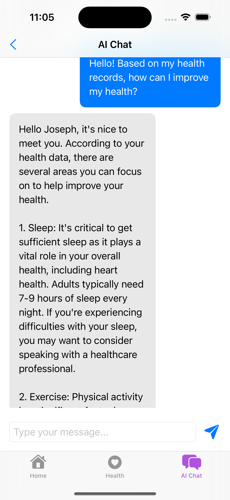

# Alwell

Alwell is a personal health assistant app designed to help users manage their health by syncing data from Apple Health and providing insights via AI. The app offers a user-friendly interface to track health metrics like heart rate, steps, sleep, and more, while also offering personalized health advice through an AI-powered chat feature.

## Screenshots

### Welcome Screen


### FAQ


### Home Screen


### Health Data Screen


### AI Health Chat


### AI Health Chat Response



## Demo

Here's a demo of the app in action:


## Features

- **Health Data Syncing**: Alwell integrates with Apple Health to sync and display various health metrics, including heart rate, steps, sleep analysis, weight, calories burned, exercise minutes, physical effort (MET), respiratory rate, and cardio fitness (VO2 Max).
- **AI-Powered Health Insights**: The app uses OpenAI's GPT-4 to provide personalized health advice based on the synced health data and user profile.
- **User-Friendly Interface**: The app provides an intuitive and visually appealing interface, adapting to both light and dark themes.
- **Personalized Greetings**: Alwell greets the user by their first name, which is saved locally and can be updated if the app is reinstalled.
- **Secure and Private**: All user data is stored locally on the device. The app does not send any data to external servers.

## Getting Started

### Prerequisites

- Xcode 12 or later
- Swift 5.3 or later
- An Apple Developer account for HealthKit permissions
- OpenAI API Key for accessing GPT-4

### Installation

1. **Clone the Repository**:
   ```bash
   git clone https://github.com/AdhamKhalifa/alwell.git
   cd alwell
   ```

### Open the Project:

1. Open `Alwell.xcodeproj` in Xcode.

### Set Up HealthKit:

1. Ensure that HealthKit is enabled in your Xcode project under `Signing & Capabilities`.
2. Configure HealthKit permissions as required by your app.

### Add Your OpenAI API Key:

1. Open `AIManager.swift`.
2. Replace the placeholder API key with your actual OpenAI API key:

   ```swift
   private let openAIAPIKey = "your-openai-api-key"
   ```

### Build and Run:

1. Select your target device or simulator.
2. Click the Run button in Xcode.

## Usage

### Welcome Screen:

- On first launch, the app will prompt you to enter your first name, birthdate, gender, ethnicity, and any chronic diseases. This information is stored locally.

### Sync Health Data:

- Tap the sync button on the home screen to fetch and display your health data from Apple Health.

### AI Health Chat:

- Navigate to the AI Chat tab to interact with the AI health assistant. The AI will use your synced health data and user profile to provide personalized advice.

### View Health Metrics:

- View your synced health data on the home screen and in the Health tab.

## Customization

- **Dark Mode Support**: The app adapts its UI colors based on the system's appearance settings.
- **User Notifications**: The app sends AI messages to the user's notifications.

## Project Structure

- `AlwellApp.swift`: Entry point of the app, managing the root view and initial setup.
- `WelcomeView.swift`: Handles the user setup process, including collecting user information.
- `HealthManager.swift`: Manages syncing health data from Apple Health.
- `AIManager.swift`: Handles communication with OpenAI's GPT-4 API for generating health insights.
- `AIView.swift`: The UI for interacting with the AI health assistant.
- `ContentView.swift`: Displays health metrics in a scrollable view.

## License

This project is licensed under the MIT License.

## Acknowledgments

- **OpenAI** for providing the GPT-4 API.
- **Apple** for the HealthKit framework.
- **MacPaw** for inspiring the OpenAI integration approach.

## FAQ

### How is my data stored?

- Your data is stored locally on your device. Alwell does not send any data to external servers.

### What data does the app collect?

- Alwell collects health metrics like heart rate, steps, sleep, and more from Apple Health. You can see the exact data collected on the home screen.

### Can I delete my data?

- Since all data is stored locally, you can delete the app from your device to remove all stored data.

### Is my data shared with anyone?

- No, Alwell does not share your data with anyone. All data stays on your device.

## Contact

For any questions or suggestions, feel free to open an issue or contact the author at `adham@adhamkhalifa.com`.
